# ShieldsVPN — UML diagrams

UML views of the whole system: the `pqvpn` VPN engine, the web portal, the Windows clients and the Android app. They
describe the code on branch `shieldsvpn-android-security-upgrade` as of 2026-10-30. The wire protocol is specified in
[PROTOCOL.md](PROTOCOL.md) and the system in [SPEC.md](SPEC.md); when a diagram and those documents disagree, the
documents and the code win.

The diagrams are written in [Mermaid](https://mermaid.js.org/), which GitHub renders directly (in VS Code, use a
Mermaid preview extension). Mermaid has no dedicated syntax for use case, package, component, deployment and object
diagrams, so those are drawn with flowchart or class syntax and UML stereotypes («actor», «component», «device»…).
Communication, timing, interaction-overview and composite-structure diagrams are not included: the sequence and
state diagrams already carry that information.

## Index

| No. | Diagram name | UML type |
| --- | --- | --- |
| 1 | ShieldsVPN use cases | Use case |
| 2 | `pqvpn` package structure | Package |
| 3 | System components and interfaces | Component |
| 4 | Runtime deployment | Deployment |
| 5.1 | Crypto and PKI classes | Class |
| 5.2 | Handshake, sessions and protocol helpers | Class |
| 5.3 | Nodes, transports, TUN devices and configuration | Class |
| 5.4 | Portal server classes | Class |
| 5.5 | Portal database (SQLite schema) | Class |
| 5.6 | Desktop and shared app clients | Class |
| 5.7 | Android app (Kotlin) | Class |
| 5.8 | Android UI (React) | Class |
| 6 | PKI chain and a live peer | Object |
| 7.1 | VPN handshake and first data | Sequence |
| 7.2 | Android connect | Sequence |
| 7.3 | App device enrollment (Free, no account) | Sequence |
| 7.4 | Free time from a rewarded ad | Sequence |
| 7.5 | Choosing a Pro plan and paying | Sequence |
| 7.6 | Admin sets the Pro prices | Sequence |
| 7.7 | Web sign-in with two-factor authentication | Sequence |
| 7.8 | Password reset with an emailed code | Sequence |
| 7.9 | Profile download, connection and revocation | Sequence |
| 8.1 | Handshake initiator | State machine |
| 8.2 | Keypair slots of a peer | State machine |
| 8.3 | Desktop client connection | State machine |
| 8.4 | Android connection phase | State machine |
| 8.5 | App device access (Free and Pro) | State machine |
| 8.6 | Account plan and Pro subscription | State machine |
| 8.7 | Portal web session | State machine |
| 9.1 | Server handling of one UDP datagram | Activity |
| 9.2 | Android tunnel-settings validation | Activity |
| 9.3 | Web sign-in with lockout | Activity |
| 9.4 | Saving the payment settings | Activity |

## 1. Use case diagram

### ShieldsVPN use cases

Who uses the system and for what. "Pro subscriber" is an end user who bought Pro; Paddle, Google AdMob, the mail
server and Firebase are secondary actors.

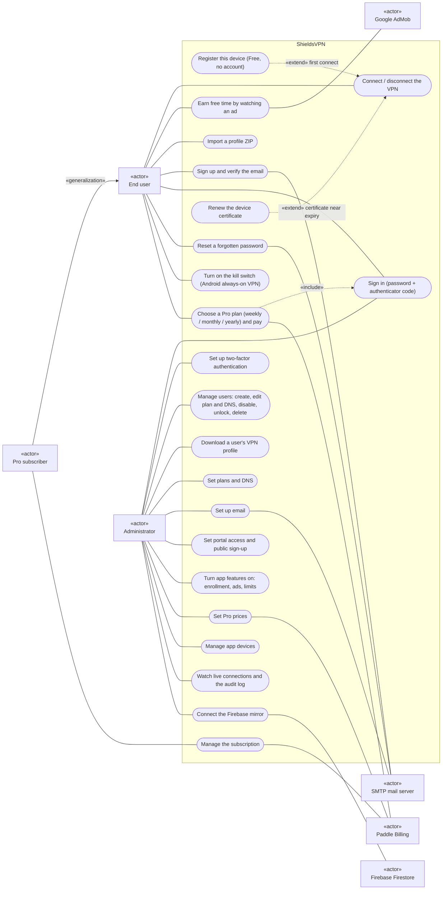
```mermaid
flowchart LR
    user["«actor»<br/>End user"]
    pro["«actor»<br/>Pro subscriber"]
    admin["«actor»<br/>Administrator"]
    paddle["«actor»<br/>Paddle Billing"]
    admob["«actor»<br/>Google AdMob"]
    smtp["«actor»<br/>SMTP mail server"]
    fire["«actor»<br/>Firebase Firestore"]
    pro -->|"«generalization»"| user

    subgraph sys["ShieldsVPN"]
        U1(["Connect / disconnect the VPN"])
        U2(["Register this device (Free, no account)"])
        U3(["Earn free time by watching an ad"])
        U4(["Import a profile ZIP"])
        U5(["Sign up and verify the email"])
        U6(["Sign in (password + authenticator code)"])
        U7(["Reset a forgotten password"])
        U8(["Turn on the kill switch (Android always-on VPN)"])
        U9(["Renew the device certificate"])
        P1(["Choose a Pro plan (weekly / monthly / yearly) and pay"])
        P2(["Manage the subscription"])
        S1(["Set up two-factor authentication"])
        A1(["Manage users: create, edit plan and DNS, disable, unlock, delete"])
        A2(["Download a user's VPN profile"])
        A3(["Set plans and DNS"])
        A4(["Set up email"])
        A5(["Set portal access and public sign-up"])
        A6(["Turn app features on: enrollment, ads, limits"])
        A7(["Set Pro prices"])
        A8(["Manage app devices"])
        A9(["Watch live connections and the audit log"])
        A10(["Connect the Firebase mirror"])
    end

    user --- U1
    user --- U3
    user --- U4
    user --- U5
    user --- U6
    user --- U7
    user --- U8
    user --- P1
    pro --- P2
    admin --- U6
    admin --- S1
    admin --- A1
    admin --- A2
    admin --- A3
    admin --- A4
    admin --- A5
    admin --- A6
    admin --- A7
    admin --- A8
    admin --- A9
    admin --- A10

    U2 -.->|"«extend» first connect"| U1
    U9 -.->|"«extend» certificate near expiry"| U1
    P1 -.->|"«include»"| U6
    U3 --- admob
    P1 --- paddle
    P2 --- paddle
    A7 --- paddle
    U5 --- smtp
    U7 --- smtp
    A4 --- smtp
    A10 --- fire
```

## 2. Package diagram

### `pqvpn` package structure

Python packages and the logical layers of the top-level modules, with their import dependencies. Android packages
only the modules listed in `syncPqvpnPython` (crypto, protocol core, `node`, `config`, `account_client`,
`android_client`).

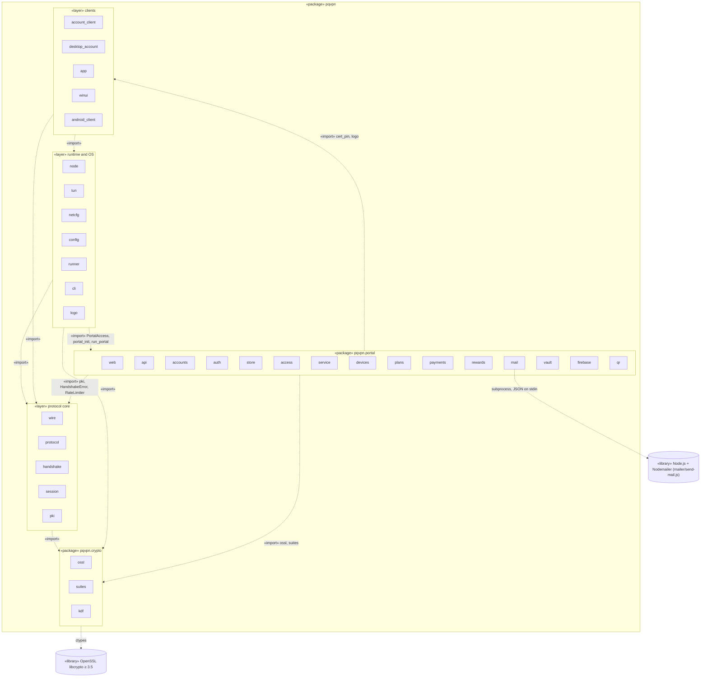
```mermaid
flowchart TB
    subgraph pq["«package» pqvpn"]
        direction TB
        subgraph crypto["«package» pqvpn.crypto"]
            ossl["ossl"]
            suites["suites"]
            kdf["kdf"]
        end
        subgraph core["«layer» protocol core"]
            wire["wire"]
            protocol["protocol"]
            handshake["handshake"]
            session["session"]
            pki["pki"]
        end
        subgraph runtime["«layer» runtime and OS"]
            node["node"]
            tun["tun"]
            netcfg["netcfg"]
            config["config"]
            runner["runner"]
            cli["cli"]
            logo["logo"]
        end
        subgraph clients["«layer» clients"]
            account_client["account_client"]
            desktop_account["desktop_account"]
            app["app"]
            winui["winui"]
            android_client["android_client"]
        end
        subgraph portal["«package» pqvpn.portal"]
            web["web"]
            api["api"]
            accounts["accounts"]
            auth["auth"]
            store["store"]
            access["access"]
            service["service"]
            devices["devices"]
            plans["plans"]
            payments["payments"]
            rewards["rewards"]
            mail["mail"]
            vault["vault"]
            firebase["firebase"]
            qr["qr"]
        end
    end
    openssl[("«library» OpenSSL libcrypto ≥ 3.5")]
    nodemailer[("«library» Node.js + Nodemailer (mailer/send-mail.js)")]

    core -.->|"«import»"| crypto
    runtime -.->|"«import»"| core
    runtime -.->|"«import»"| crypto
    runtime -.->|"«import» PortalAccess, portal_init, run_portal"| portal
    clients -.->|"«import»"| runtime
    clients -.->|"«import»"| core
    portal -.->|"«import» pki, HandshakeError, RateLimiter"| core
    portal -.->|"«import» ossl, suites"| crypto
    portal -.->|"«import» cert_pin, logo"| clients
    crypto -.->|"ctypes"| openssl
    mail -.->|"subprocess, JSON on stdin"| nodemailer
```

## 3. Component diagram

### System components and interfaces

The running components and the interfaces between them. Edge labels name the interface (protocol, API or file).

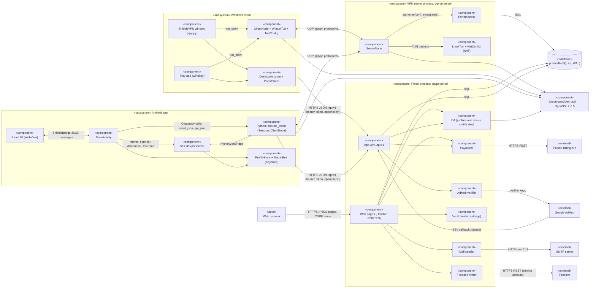
```mermaid
flowchart LR
    subgraph vpnsrv["«subsystem» VPN server process: pqvpn server"]
        SN["«component»<br/>ServerNode"]
        PA["«component»<br/>PortalAccess"]
        STUN["«component»<br/>LinuxTun + NetConfig (NAT)"]
    end
    subgraph portalp["«subsystem» Portal process: pqvpn portal"]
        WEB["«component»<br/>Web pages (Handler, ROUTES)"]
        API["«component»<br/>App API /api/v1"]
        PAY["«component»<br/>Payments"]
        RW["«component»<br/>AdMob verifier"]
        MIR["«component»<br/>Firebase mirror"]
        MAIL["«component»<br/>Mail sender"]
        CA["«component»<br/>CA (profiles and device certificates)"]
        VAULT["«component»<br/>Vault (sealed settings)"]
    end
    DB[("«database»<br/>portal.db (SQLite, WAL)")]
    CRY["«component»<br/>Crypto provider: ossl → OpenSSL ≥ 3.5"]
    subgraph win["«subsystem» Windows client"]
        APPW["«component»<br/>ShieldsVPN window (app.py)"]
        TRAY["«component»<br/>Tray app (winui.py)"]
        DA["«component»<br/>DesktopAccount + PortalClient"]
        CNW["«component»<br/>ClientNode + WintunTun + NetConfig"]
    end
    subgraph andr["«subsystem» Android app"]
        UI["«component»<br/>React UI (WebView)"]
        MA["«component»<br/>MainActivity"]
        SVC["«component»<br/>ShieldsVpnService"]
        PY["«component»<br/>Python: android_client (Session, ClientNode)"]
        KS["«component»<br/>ProfileStore + SecretBox (Keystore)"]
    end
    BROWSER["«actor»<br/>Web browser"]
    PADDLE["«external»<br/>Paddle Billing API"]
    ADMOB["«external»<br/>Google AdMob"]
    FIRE["«external»<br/>Firestore"]
    SMTP["«external»<br/>SMTP server"]

    CNW <-->|"UDP: pqvpn protocol v1"| SN
    PY <-->|"UDP: pqvpn protocol v1"| SN
    SN -->|"authorize(cert), sync(peers)"| PA
    SN -->|"TUN packets"| STUN
    PA -->|"SQL"| DB
    WEB -->|"SQL"| DB
    API -->|"SQL"| DB
    WEB --> PAY
    API --> PAY
    API --> RW
    WEB --> CA
    API --> CA
    WEB --> MAIL
    WEB --> MIR
    WEB --> VAULT
    BROWSER -->|"HTTPS: HTML pages, CSRF forms"| WEB
    APPW --> DA
    TRAY --> DA
    APPW -->|"run_client"| CNW
    TRAY -->|"run_client"| CNW
    DA -->|"HTTPS JSON /api/v1 (bearer token, optional pin)"| API
    UI <-->|"ShieldsBridge JSON messages"| MA
    MA -->|"Intents: connect, disconnect, free time"| SVC
    MA -->|"Chaquopy calls: enroll_json, api_json"| PY
    SVC <-->|"PythonVpnBridge"| PY
    MA --> KS
    SVC --> KS
    PY -->|"HTTPS JSON /api/v1 (bearer token, optional pin)"| API
    PAY -->|"HTTPS REST"| PADDLE
    ADMOB -->|"SSV callback (signed)"| API
    RW -->|"verifier keys"| ADMOB
    MIR -->|"HTTPS REST (service account)"| FIRE
    MAIL -->|"SMTP over TLS"| SMTP
    SN --> CRY
    CNW --> CRY
    PY --> CRY
    CA --> CRY
```

## 4. Deployment diagram

### Runtime deployment

Where each artifact runs. The live deployment today is WSL Ubuntu on the owner's PC (portal on port 8800) plus a Kali
VM reached through playit.gg; both run the same server artifacts.

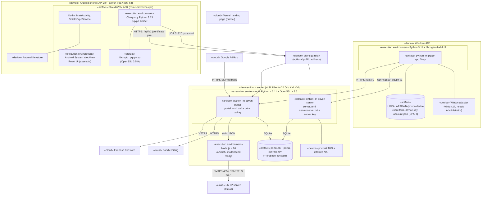
```mermaid
flowchart TB
    subgraph srv["«device» Linux server (WSL Ubuntu 24.04 / Kali VM)"]
        subgraph pyenv["«execution environment» Python ≥ 3.11 + OpenSSL ≥ 3.5"]
            vpnart["«artifact» python -m pqvpn server<br/>server.toml, server/server.crt + server.key"]
            portart["«artifact» python -m pqvpn portal<br/>portal.toml, ca/ca.crt + ca.key"]
        end
        nodeenv["«execution environment» Node.js ≥ 20<br/>«artifact» mailer/send-mail.js"]
        dbart[("«artifact» portal.db + portal-secrets.key<br/>(+ firebase-key.json)")]
        tundev["«device» pqvpn0 TUN + iptables NAT"]
    end
    relay["«device» playit.gg relay (optional public address)"]
    subgraph pc["«device» Windows PC"]
        subgraph winpy["«execution environment» Python 3.11 + libcrypto-4-x64.dll"]
            winart["«artifact» python -m pqvpn app / tray"]
        end
        wintun["«device» Wintun adapter (wintun.dll, needs Administrator)"]
        windata[("«artifact» LOCALAPPDATA/pqvpn/device<br/>client.toml, device.key, account.json (DPAPI)")]
    end
    subgraph phone["«device» Android phone (API 24+, arm64-v8a / x86_64)"]
        subgraph apk["«artifact» ShieldsVPN APK (com.shieldsvpn.vpn)"]
            kot["Kotlin: MainActivity, ShieldsVpnService"]
            webv["«execution environment» Android System WebView<br/>React UI (assets/ui)"]
            chaq["«execution environment» Chaquopy Python 3.13<br/>pqvpn subset"]
            libc["«artifact» libcrypto_pqvpn.so (OpenSSL 3.5.9)"]
        end
        keystore["«device» Android Keystore"]
    end
    vercel["«cloud» Vercel: landing page (public/)"]
    paddle["«cloud» Paddle Billing"]
    google["«cloud» Google AdMob"]
    firestore["«cloud» Firebase Firestore"]
    gmail["«cloud» SMTP server (Gmail)"]

    vpnart --- tundev
    vpnart -->|"SQLite"| dbart
    portart -->|"SQLite"| dbart
    portart -->|"stdin JSON"| nodeenv
    winart --- wintun
    winart --- windata
    winart -->|"UDP 51820: pqvpn v1"| vpnart
    winart -->|"HTTPS: /api/v1"| portart
    chaq -->|"UDP 51820: pqvpn v1"| relay
    chaq -->|"HTTPS: /api/v1 (certificate pin)"| relay
    relay --> vpnart
    relay --> portart
    kot --- keystore
    chaq --- libc
    portart -->|"HTTPS"| paddle
    google -->|"HTTPS SSV callback"| portart
    portart -->|"HTTPS"| firestore
    nodeenv -->|"SMTPS 465 / STARTTLS 587"| gmail
```

## 5. Class diagrams

### 5.1 Crypto and PKI classes

Every primitive runs in OpenSSL through `ossl`; `suites` is the crypto-agility registry; `pki` holds the PQVPN
certificate format and trust policy.

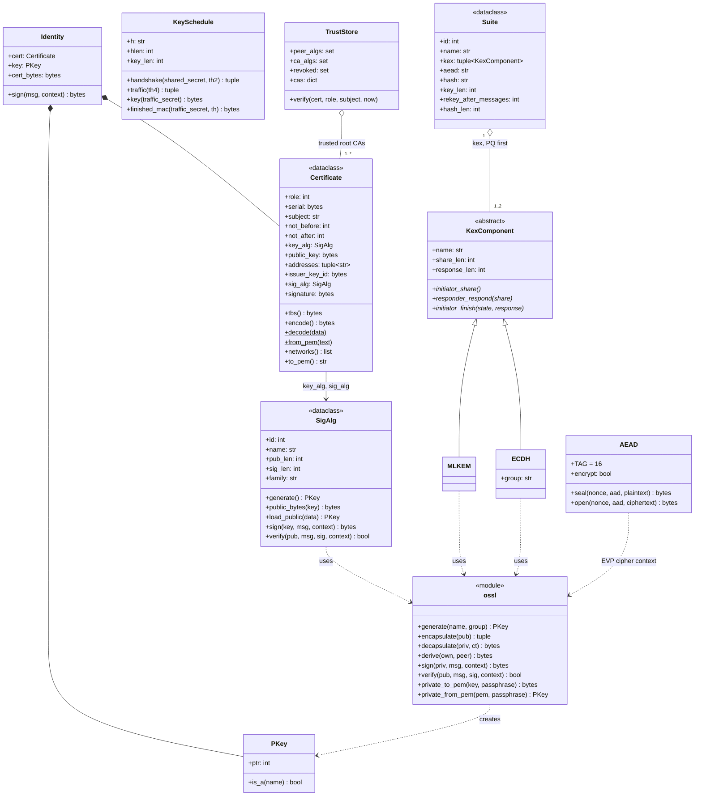
```mermaid
classDiagram
    class ossl {
        <<module>>
        +generate(name, group) PKey
        +encapsulate(pub) tuple
        +decapsulate(priv, ct) bytes
        +derive(own, peer) bytes
        +sign(priv, msg, context) bytes
        +verify(pub, msg, sig, context) bool
        +private_to_pem(key, passphrase) bytes
        +private_from_pem(pem, passphrase) PKey
    }
    class PKey {
        +ptr: int
        +is_a(name) bool
    }
    class AEAD {
        +TAG = 16
        +encrypt: bool
        +seal(nonce, aad, plaintext) bytes
        +open(nonce, aad, ciphertext) bytes
    }
    class KexComponent {
        <<abstract>>
        +name: str
        +share_len: int
        +response_len: int
        +initiator_share()*
        +responder_respond(share)*
        +initiator_finish(state, response)*
    }
    class MLKEM
    class ECDH {
        +group: str
    }
    class Suite {
        <<dataclass>>
        +id: int
        +name: str
        +kex: tuple~KexComponent~
        +aead: str
        +hash: str
        +key_len: int
        +rekey_after_messages: int
        +hash_len: int
    }
    class SigAlg {
        <<dataclass>>
        +id: int
        +name: str
        +pub_len: int
        +sig_len: int
        +family: str
        +generate() PKey
        +public_bytes(key) bytes
        +load_public(data) PKey
        +sign(key, msg, context) bytes
        +verify(pub, msg, sig, context) bool
    }
    class KeySchedule {
        +h: str
        +hlen: int
        +key_len: int
        +handshake(shared_secret, th2) tuple
        +traffic(th4) tuple
        +key(traffic_secret) bytes
        +finished_mac(traffic_secret, th) bytes
    }
    class Certificate {
        <<dataclass>>
        +role: int
        +serial: bytes
        +subject: str
        +not_before: int
        +not_after: int
        +key_alg: SigAlg
        +public_key: bytes
        +addresses: tuple~str~
        +issuer_key_id: bytes
        +sig_alg: SigAlg
        +signature: bytes
        +tbs() bytes
        +encode() bytes
        +decode(data)$
        +from_pem(text)$
        +networks() list
        +to_pem() str
    }
    class Identity {
        +cert: Certificate
        +key: PKey
        +cert_bytes: bytes
        +sign(msg, context) bytes
    }
    class TrustStore {
        +peer_algs: set
        +ca_algs: set
        +revoked: set
        +cas: dict
        +verify(cert, role, subject, now)
    }
    KexComponent <|-- MLKEM
    KexComponent <|-- ECDH
    Suite "1" o-- "1..2" KexComponent : kex, PQ first
    Certificate --> SigAlg : key_alg, sig_alg
    Identity *-- Certificate
    Identity *-- PKey
    TrustStore o-- "1..*" Certificate : trusted root CAs
    SigAlg ..> ossl : uses
    MLKEM ..> ossl : uses
    ECDH ..> ossl : uses
    AEAD ..> ossl : EVP cipher context
    ossl ..> PKey : creates
```

### 5.2 Handshake, sessions and protocol helpers

The pure handshake state machines (no I/O), the per-session keypair with its replay window, and the DoS helpers.

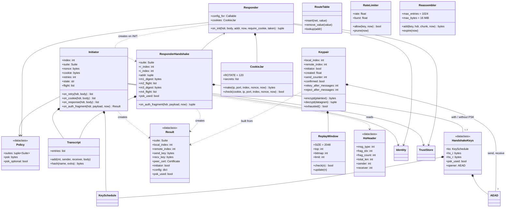
```mermaid
classDiagram
    class Policy {
        <<dataclass>>
        +suites: tuple~Suite~
        +psk: bytes
        +psk_optional: bool
    }
    class Transcript {
        +entries: list
        +add(mt, sender, receiver, body)
        +hash(name, extra) bytes
    }
    class Initiator {
        +index: int
        +suite: Suite
        +nonce: bytes
        +cookie: bytes
        +retries: int
        +state: str
        +flight: list
        +on_retry(hdr, body) list
        +on_cookie(hdr, body) list
        +on_response(hdr, body) list
        +on_auth_fragment(hdr, payload, now) Result
    }
    class Responder {
        +config_for: Callable
        +cookies: CookieJar
        +on_init(hdr, body, addr, now, require_cookie, taken) tuple
    }
    class ResponderHandshake {
        +suite: Suite
        +r_index: int
        +i_index: int
        +addr: tuple
        +m1_digest: bytes
        +m2_flight: list
        +m3_digest: bytes
        +m4_flight: list
        +psk_used: bool
        +on_auth_fragment(hdr, payload, now) tuple
    }
    class HandshakeKeys {
        <<dataclass>>
        +ks: KeySchedule
        +hs_i: bytes
        +hs_r: bytes
        +psk_used: bool
        +opener: AEAD
    }
    class Result {
        <<dataclass>>
        +suite: Suite
        +local_index: int
        +remote_index: int
        +send_key: bytes
        +recv_key: bytes
        +peer_cert: Certificate
        +initiator: bool
        +config: dict
        +psk_used: bool
    }
    class Keypair {
        +local_index: int
        +remote_index: int
        +initiator: bool
        +created: float
        +send_counter: int
        +confirmed: bool
        +rekey_after_messages: int
        +reject_after_messages: int
        +encrypt(plaintext) bytes
        +decrypt(datagram) tuple
        +exhausted() bool
    }
    class ReplayWindow {
        +SIZE = 2048
        +top: int
        +bitmap: int
        +limit: int
        +check(n) bool
        +update(n)
    }
    class RouteTable {
        +insert(net, value)
        +remove_value(value)
        +lookup(addr)
    }
    class CookieJar {
        +ROTATE = 120
        +secrets: list
        +make(ip, port, index, nonce, now) bytes
        +check(cookie, ip, port, index, nonce, now) bool
    }
    class RateLimiter {
        +rate: float
        +burst: float
        +allow(key, now) bool
        +prune(now)
    }
    class Reassembler {
        +max_entries = 1024
        +max_bytes = 16 MiB
        +add(key, hdr, chunk, now) bytes
        +expire(now)
    }
    class HsHeader {
        <<dataclass>>
        +msg_type: int
        +frag_idx: int
        +frag_count: int
        +total_len: int
        +sender: int
        +receiver: int
    }
    class KeySchedule
    class AEAD
    class Identity
    class TrustStore
    Initiator --> Policy
    Initiator --> Identity
    Initiator --> TrustStore
    Initiator *-- Transcript
    Initiator *-- KeySchedule
    Initiator ..> HsHeader : reads
    Initiator ..> Result : creates
    Responder --> Policy
    Responder --> Identity
    Responder --> TrustStore
    Responder *-- CookieJar
    Responder ..> ResponderHandshake : creates on INIT
    ResponderHandshake --> Responder
    ResponderHandshake *-- Transcript
    ResponderHandshake *-- "1..2" HandshakeKeys : with / without PSK
    ResponderHandshake ..> Result : creates
    HandshakeKeys *-- KeySchedule
    HandshakeKeys *-- AEAD
    Keypair ..> Result : built from
    Keypair *-- "2" AEAD : send, receive
    Keypair *-- ReplayWindow
```

### 5.3 Nodes, transports, TUN devices and configuration

The event-loop side: one `ServerNode` with many peers, or one `ClientNode` with one; any TUN device; the TOML
configuration objects.

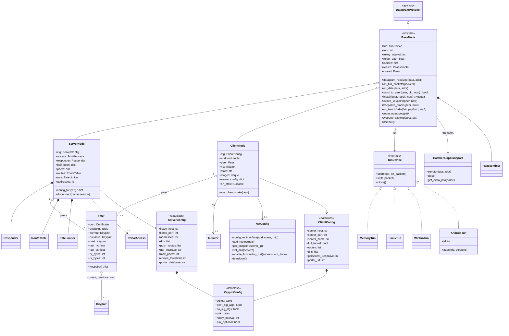
```mermaid
classDiagram
    class DatagramProtocol {
        <<asyncio>>
    }
    class BaseNode {
        <<abstract>>
        +tun: TunDevice
        +mtu: int
        +rekey_interval: int
        +reject_after: float
        +indices: dict
        +reasm: Reassembler
        +closed: Event
        +datagram_received(data, addr)
        +on_tun_packets(packets)
        +on_data(data, addr)
        +send_to_peer(peer, pkt, now) bool
        +install(peer, result, now) Keypair
        +expire_keypairs(peer, now)
        +keepalive_timers(peer, now)
        +on_handshake(hdr, payload, addr)*
        +route_outbound(pkt)*
        +inbound_allowed(peer, pkt)*
        +tick(now)*
    }
    class ServerNode {
        +cfg: ServerConfig
        +access: PortalAccess
        +responder: Responder
        +half_open: dict
        +peers: dict
        +routes: RouteTable
        +rate: RateLimiter
        +addresses: list
        +config_for(cert) dict
        +disconnect(name, reason)
    }
    class ClientNode {
        +cfg: ClientConfig
        +endpoint: tuple
        +peer: Peer
        +hs: Initiator
        +state: str
        +staged: deque
        +server_config: dict
        +on_state: Callable
        +start_handshake(now)
    }
    class Peer {
        +cert: Certificate
        +endpoint: tuple
        +current: Keypair
        +previous: Keypair
        +next: Keypair
        +last_rx: float
        +last_tx: float
        +rx_bytes: int
        +tx_bytes: int
        +keypairs() list
    }
    class BatchedUdpTransport {
        +sendto(data, addr)
        +close()
        +get_extra_info(name)
    }
    class TunDevice {
        <<interface>>
        +start(loop, on_packets)
        +write(packet)
        +close()
    }
    class MemoryTun
    class LinuxTun
    class WintunTun
    class AndroidTun {
        +fd: int
        +attach(fd, versions)
    }
    class NetConfig {
        +configure_interface(addresses, mtu)
        +add_routes(nets)
        +pin_endpoint(server_ip)
        +set_dns(servers)
        +enable_forwarding_nat(subnets, out_iface)
        +teardown()
    }
    class CryptoConfig {
        <<dataclass>>
        +suites: tuple
        +peer_sig_algs: tuple
        +ca_sig_algs: tuple
        +psk: bytes
        +rekey_interval: int
        +psk_optional: bool
    }
    class ServerConfig {
        <<dataclass>>
        +listen_host: str
        +listen_port: int
        +addresses: list
        +dns: list
        +push_routes: list
        +nat_interface: str
        +max_peers: int
        +cookie_threshold: int
        +portal_database: str
    }
    class ClientConfig {
        <<dataclass>>
        +server_host: str
        +server_port: int
        +server_name: str
        +full_tunnel: bool
        +routes: list
        +dns: list
        +persistent_keepalive: int
        +portal_url: str
    }
    class PortalAccess
    class Responder
    class Initiator
    class RouteTable
    class RateLimiter
    class Reassembler
    class Keypair
    DatagramProtocol <|-- BaseNode
    BaseNode <|-- ServerNode
    BaseNode <|-- ClientNode
    BaseNode --> TunDevice : tun
    BaseNode --> BatchedUdpTransport : transport
    BaseNode *-- Reassembler
    TunDevice <|.. MemoryTun
    TunDevice <|.. LinuxTun
    TunDevice <|.. WintunTun
    TunDevice <|.. AndroidTun
    ServerNode *-- Responder
    ServerNode "1" o-- "*" Peer : peers
    ServerNode *-- RouteTable
    ServerNode *-- RateLimiter
    ServerNode --> "0..1" PortalAccess
    ServerNode --> ServerConfig
    ClientNode "1" o-- "0..1" Peer : peer
    ClientNode --> "0..1" Initiator : hs
    ClientNode --> "0..1" NetConfig
    ClientNode --> ClientConfig
    Peer o-- "0..3" Keypair : current, previous, next
    ServerConfig *-- CryptoConfig
    ClientConfig *-- CryptoConfig
```

### 5.4 Portal server classes

The portal process: the HTTP handler, its services, and the modules whose functions hold the business rules.

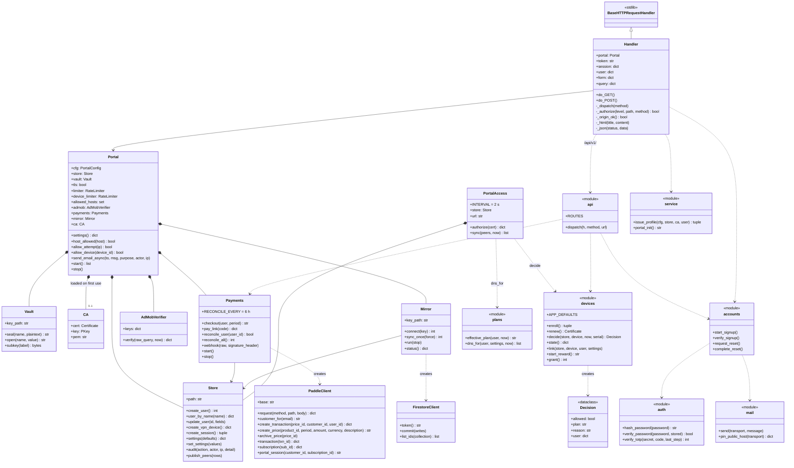
```mermaid
classDiagram
    class BaseHTTPRequestHandler {
        <<stdlib>>
    }
    class Handler {
        +portal: Portal
        +token: str
        +session: dict
        +user: dict
        +form: dict
        +query: dict
        +do_GET()
        +do_POST()
        -_dispatch(method)
        -_authorize(level, path, method) bool
        -_origin_ok() bool
        -_html(title, content)
        -_json(status, data)
    }
    class Portal {
        +cfg: PortalConfig
        +store: Store
        +vault: Vault
        +tls: bool
        +limiter: RateLimiter
        +device_limiter: RateLimiter
        +allowed_hosts: set
        +admob: AdMobVerifier
        +payments: Payments
        +mirror: Mirror
        +ca: CA
        +settings() dict
        +host_allowed(host) bool
        +allow_attempt(ip) bool
        +allow_device(device_id) bool
        +send_email_async(to, msg, purpose, actor, ip)
        +start() list
        +stop()
    }
    class Store {
        +path: str
        +create_user() int
        +user_by_name(name) dict
        +update_user(id, fields)
        +create_vpn_device() dict
        +create_session() tuple
        +settings(defaults) dict
        +set_settings(values)
        +audit(action, actor, ip, detail)
        +publish_peers(rows)
    }
    class Vault {
        +key_path: str
        +seal(name, plaintext) str
        +open(name, value) str
        +subkey(label) bytes
    }
    class CA {
        +cert: Certificate
        +key: PKey
        +pem: str
    }
    class Payments {
        +RECONCILE_EVERY = 6 h
        +checkout(user, period) str
        +pay_link(code) dict
        +reconcile_user(user_id) bool
        +reconcile_all() int
        +webhook(raw, signature_header)
        +start()
        +stop()
    }
    class PaddleClient {
        +base: str
        +request(method, path, body) dict
        +customer_for(email) str
        +create_transaction(price_id, customer_id, user_id) dict
        +create_price(product_id, period, amount, currency, description) str
        +archive_price(price_id)
        +transaction(txn_id) dict
        +subscription(sub_id) dict
        +portal_session(customer_id, subscription_id) str
    }
    class AdMobVerifier {
        +keys: dict
        +verify(raw_query, now) dict
    }
    class Mirror {
        +key_path: str
        +connect(key) int
        +sync_once(force) int
        +run(stop)
        +status() dict
    }
    class FirestoreClient {
        +token() str
        +commit(writes)
        +list_ids(collection) list
    }
    class PortalAccess {
        +INTERVAL = 2 s
        +store: Store
        +url: str
        +authorize(cert) dict
        +sync(peers, now) list
    }
    class Decision {
        <<dataclass>>
        +allowed: bool
        +plan: str
        +reason: str
        +user: dict
    }
    class api {
        <<module>>
        +ROUTES
        +dispatch(h, method, url)
    }
    class devices {
        <<module>>
        +APP_DEFAULTS
        +enroll() tuple
        +renew() Certificate
        +decide(store, device, now, serial) Decision
        +state() dict
        +link(store, device, user, settings)
        +start_reward() str
        +grant() int
    }
    class accounts {
        <<module>>
        +start_signup()
        +verify_signup()
        +request_reset()
        +complete_reset()
    }
    class auth {
        <<module>>
        +hash_password(password) str
        +verify_password(password, stored) bool
        +verify_totp(secret, code, last_step) int
    }
    class plans {
        <<module>>
        +effective_plan(user, now) str
        +dns_for(user, settings, now) list
    }
    class service {
        <<module>>
        +issue_profile(cfg, store, ca, user) tuple
        +portal_init() str
    }
    class mail {
        <<module>>
        +send(transport, message)
        +pin_public_host(transport) dict
    }
    BaseHTTPRequestHandler <|-- Handler
    Handler --> Portal
    Handler ..> api : /api/v1/
    Portal *-- Store
    Portal *-- Vault
    Portal *-- Payments
    Portal *-- Mirror
    Portal *-- AdMobVerifier
    Portal *-- "0..1" CA : loaded on first use
    Payments --> Store
    Payments ..> PaddleClient : creates
    Mirror --> Store
    Mirror ..> FirestoreClient : creates
    PortalAccess *-- Store
    PortalAccess ..> devices : decide
    PortalAccess ..> plans : dns_for
    devices ..> Decision : creates
    api ..> devices
    api ..> accounts
    api ..> Payments
    Handler ..> accounts
    Handler ..> service
    accounts ..> auth
    accounts ..> mail
```

### 5.5 Portal database (SQLite schema)

The tables in `portal.db` (`portal/store.py`), shared by the portal (writer) and the VPN server (reader, and writer of
live status). Arrows are foreign keys; `peers.username` matches a user name or a device subject.

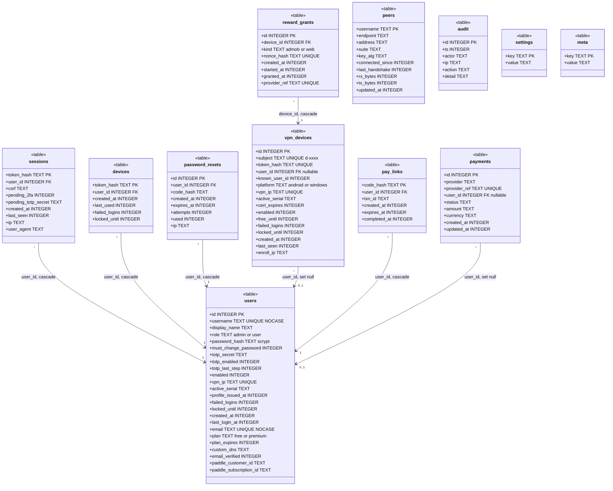
```mermaid
classDiagram
    class users {
        <<table>>
        +id INTEGER PK
        +username TEXT UNIQUE NOCASE
        +display_name TEXT
        +role TEXT admin or user
        +password_hash TEXT scrypt
        +must_change_password INTEGER
        +totp_secret TEXT
        +totp_enabled INTEGER
        +totp_last_step INTEGER
        +enabled INTEGER
        +vpn_ip TEXT UNIQUE
        +active_serial TEXT
        +profile_issued_at INTEGER
        +failed_logins INTEGER
        +locked_until INTEGER
        +created_at INTEGER
        +last_login_at INTEGER
        +email TEXT UNIQUE NOCASE
        +plan TEXT free or premium
        +plan_expires INTEGER
        +custom_dns TEXT
        +email_verified INTEGER
        +paddle_customer_id TEXT
        +paddle_subscription_id TEXT
    }
    class sessions {
        <<table>>
        +token_hash TEXT PK
        +user_id INTEGER FK
        +csrf TEXT
        +pending_2fa INTEGER
        +pending_totp_secret TEXT
        +created_at INTEGER
        +last_seen INTEGER
        +ip TEXT
        +user_agent TEXT
    }
    class devices {
        <<table>>
        +token_hash TEXT PK
        +user_id INTEGER FK
        +created_at INTEGER
        +last_used INTEGER
        +failed_logins INTEGER
        +locked_until INTEGER
    }
    class password_resets {
        <<table>>
        +id INTEGER PK
        +user_id INTEGER FK
        +code_hash TEXT
        +created_at INTEGER
        +expires_at INTEGER
        +attempts INTEGER
        +used INTEGER
        +ip TEXT
    }
    class vpn_devices {
        <<table>>
        +id INTEGER PK
        +subject TEXT UNIQUE d-xxxx
        +token_hash TEXT UNIQUE
        +user_id INTEGER FK nullable
        +known_user_id INTEGER
        +platform TEXT android or windows
        +vpn_ip TEXT UNIQUE
        +active_serial TEXT
        +cert_expires INTEGER
        +enabled INTEGER
        +free_until INTEGER
        +failed_logins INTEGER
        +locked_until INTEGER
        +created_at INTEGER
        +last_seen INTEGER
        +enroll_ip TEXT
    }
    class reward_grants {
        <<table>>
        +id INTEGER PK
        +device_id INTEGER FK
        +kind TEXT admob or web
        +nonce_hash TEXT UNIQUE
        +created_at INTEGER
        +started_at INTEGER
        +granted_at INTEGER
        +provider_ref TEXT UNIQUE
    }
    class pay_links {
        <<table>>
        +code_hash TEXT PK
        +user_id INTEGER FK
        +txn_id TEXT
        +created_at INTEGER
        +expires_at INTEGER
        +completed_at INTEGER
    }
    class payments {
        <<table>>
        +id INTEGER PK
        +provider TEXT
        +provider_ref TEXT UNIQUE
        +user_id INTEGER FK nullable
        +status TEXT
        +amount TEXT
        +currency TEXT
        +created_at INTEGER
        +updated_at INTEGER
    }
    class peers {
        <<table>>
        +username TEXT PK
        +endpoint TEXT
        +address TEXT
        +suite TEXT
        +key_alg TEXT
        +connected_since INTEGER
        +last_handshake INTEGER
        +rx_bytes INTEGER
        +tx_bytes INTEGER
        +updated_at INTEGER
    }
    class audit {
        <<table>>
        +id INTEGER PK
        +ts INTEGER
        +actor TEXT
        +ip TEXT
        +action TEXT
        +detail TEXT
    }
    class settings {
        <<table>>
        +key TEXT PK
        +value TEXT
    }
    class meta {
        <<table>>
        +key TEXT PK
        +value TEXT
    }
    sessions "*" --> "1" users : user_id, cascade
    devices "*" --> "1" users : user_id, cascade
    password_resets "*" --> "1" users : user_id, cascade
    vpn_devices "*" --> "0..1" users : user_id, set null
    reward_grants "*" --> "1" vpn_devices : device_id, cascade
    pay_links "*" --> "1" users : user_id, cascade
    payments "*" --> "0..1" users : user_id, set null
```

### 5.6 Desktop and shared app clients

The Windows window and tray, the desktop device registration, the shared portal client, and the Python side of the
Android app.

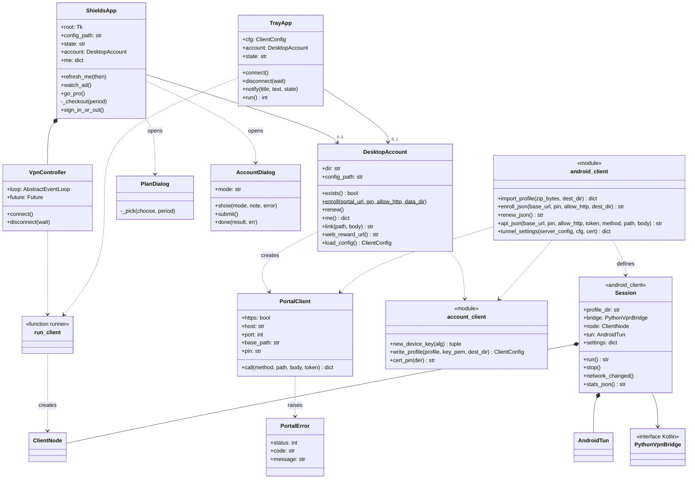
```mermaid
classDiagram
    class PortalClient {
        +https: bool
        +host: str
        +port: int
        +base_path: str
        +pin: str
        +call(method, path, body, token) dict
    }
    class PortalError {
        +status: int
        +code: str
        +message: str
    }
    class DesktopAccount {
        +dir: str
        +config_path: str
        +exists() bool
        +enroll(portal_url, pin, allow_http, data_dir)$
        +renew()
        +me() dict
        +link(path, body) str
        +web_reward_url() str
        +load_config() ClientConfig
    }
    class ShieldsApp {
        +root: Tk
        +config_path: str
        +state: str
        +account: DesktopAccount
        +me: dict
        +refresh_me(then)
        +watch_ad()
        +go_pro()
        -_checkout(period)
        +sign_in_or_out()
    }
    class VpnController {
        +loop: AbstractEventLoop
        +future: Future
        +connect()
        +disconnect(wait)
    }
    class PlanDialog {
        -_pick(choose, period)
    }
    class AccountDialog {
        +mode: str
        +show(mode, note, error)
        +submit()
        +done(result, err)
    }
    class TrayApp {
        +cfg: ClientConfig
        +account: DesktopAccount
        +state: str
        +connect()
        +disconnect(wait)
        +notify(title, text, state)
        +run() int
    }
    class Session {
        <<android_client>>
        +profile_dir: str
        +bridge: PythonVpnBridge
        +node: ClientNode
        +tun: AndroidTun
        +settings: dict
        +run() str
        +stop()
        +network_changed()
        +stats_json() str
    }
    class android_client {
        <<module>>
        +import_profile(zip_bytes, dest_dir) dict
        +enroll_json(base_url, pin, allow_http, dest_dir) str
        +renew_json() str
        +api_json(base_url, pin, allow_http, token, method, path, body) str
        +tunnel_settings(server_config, cfg, cert) dict
    }
    class account_client {
        <<module>>
        +new_device_key(alg) tuple
        +write_profile(profile, key_pem, dest_dir) ClientConfig
        +cert_pin(der) str
    }
    class run_client {
        <<function runner>>
    }
    class ClientNode
    class AndroidTun
    class PythonVpnBridge {
        <<interface Kotlin>>
    }
    DesktopAccount ..> PortalClient : creates
    DesktopAccount ..> account_client
    PortalClient ..> PortalError : raises
    ShieldsApp *-- VpnController
    ShieldsApp --> "0..1" DesktopAccount
    ShieldsApp ..> PlanDialog : opens
    ShieldsApp ..> AccountDialog : opens
    VpnController ..> run_client
    TrayApp --> "0..1" DesktopAccount
    TrayApp ..> run_client
    run_client ..> ClientNode : creates
    Session *-- ClientNode
    Session *-- AndroidTun
    Session --> PythonVpnBridge
    android_client ..> Session : defines
    android_client ..> PortalClient
    android_client ..> account_client
```

### 5.7 Android app (Kotlin)

The Kotlin classes of `android-app/app`. Python runs inside the same process through Chaquopy (`PythonRuntime`).

```mermaid
classDiagram
    class AppCompatActivity {
        <<Android>>
    }
    class VpnService {
        <<Android>>
    }
    class Application {
        <<Android>>
    }
    class ShieldsApp
    class MainActivity {
        -web: WebView
        -port: JavaScriptReplyProxy
        -profile: ProfileSummary
        -account: AccountInfo
        -onUiMessage(raw)
        -enroll(connectAfter)
        -refreshAccount()
        -accountCall(op, path, body)
        -watchAd()
        -goPro(period)
        -openFromPortal(op, path, body)
        -onConnect()
        -importProfile(uri)
        -removeProfile()
    }
    class ShieldsVpnService {
        -worker: Thread
        -session: PyObject
        -stopRequested: Boolean
        -startSession()
        -runSession()
        -requestStop()
        -scheduleFreeTime(stopAtMs)
        -registerNetworkCallback()
        +onRevoke()
    }
    class PythonVpnBridge {
        <<interface>>
        +protectSocket(fd) Boolean
        +establishTunnel(settingsJson) Int
        +onState(state, infoJson)
    }
    class PythonRuntime {
        <<object>>
        +androidClient(context) PyObject
    }
    class ProfileStore {
        <<object>>
        +hasProfile(ctx) Boolean
        +summary(ctx) ProfileSummary
        +importProfile(ctx, uri) ProfileSummary
        +installEnrolled(ctx, staging, result, token) ProfileSummary
        +loadSecrets(ctx) ProfileSecrets
        +remove(ctx)
    }
    class ProfileSummary {
        <<data>>
        +account: String
        +server: String
        +serverName: String
        +tunnelAddress: String
        +expiresEpochSeconds: Long
        +fullTunnel: Boolean
        +serial: String
        +enrolled: Boolean
    }
    class ProfileSecrets {
        +keyPem: String
        +psk: String
        +token: String
    }
    class SecretBox {
        <<object>>
        +seal(plaintext) ByteArray
        +open(blob) ByteArray
        +deleteKey()
    }
    class Portal {
        <<object>>
        +configured: Boolean
        +enroll(ctx) Pair
        +renew(ctx) ProfileSummary
        +call(ctx, method, path, body) JSONObject
    }
    class AccountInfo {
        <<data>>
        +plan: String
        +freeUntil: Long
        +proUntil: Long
        +signedIn: Boolean
        +admob: Boolean
        +payments: Boolean
        +prices: List~PriceOption~
        +clockSkew: Long
        +freeSecondsLeft(phoneNowSec) Long
        +stopAtMs() Long
    }
    class PriceOption {
        <<data>>
        +period: String
        +name: String
        +label: String
    }
    class UiJson {
        <<object>>
        +COMMANDS: Set
        +command(raw) String
        +field(raw, name, max) String
        +state(...) JSONObject
        +account(...) JSONObject
        +accountResult(op, ok, code, message) JSONObject
        +notice(ok, title, text) JSONObject
    }
    class VpnUiState {
        <<data>>
        +phase: Phase
        +active: Boolean
        +message: String
        +tunnelAddress: String
        +routes: List
        +dns: List
        +connectedSince: Long
        +alwaysOn: Boolean
        +lockdown: Boolean
    }
    class Phase {
        <<enumeration>>
        DISCONNECTED
        PREPARING
        CONNECTING
        CONNECTED
        RECONNECTING
        ERROR
        DISCONNECTING
    }
    class StateMapper {
        <<object>>
        +fromPython(prev, state, info, nowMs) VpnUiState
        +finished(prev, error, userStopped) VpnUiState
    }
    class VpnStateStore {
        <<object>>
        +state: VpnUiState
        +update(transform)
        +observe(listener)
        +remove(listener)
    }
    class TunnelConfig {
        <<data>>
        +session: String
        +mtu: Int
        +addresses: List~IpPrefix~
        +routes: List~IpPrefix~
        +dns: List
        +fullTunnel: Boolean
        +bypassFamilies: Set
        +blockedFamilies: Set
        +fromJson(json)$
    }
    class IpPrefix {
        <<data>>
        +address: String
        +prefix: Int
    }
    class Notifications {
        <<object>>
        +build(ctx, state) Notification
        +update(ctx, state)
    }
    class Ads {
        <<object>>
        +prepare(activity, ready)
        +showRewarded(activity, nonce, deviceName, done)
        +showInterstitial(activity)
    }
    class Redact {
        <<object>>
        +text(s) String
        +pythonError(t) String
    }
    Application <|-- ShieldsApp
    AppCompatActivity <|-- MainActivity
    VpnService <|-- ShieldsVpnService
    ShieldsVpnService ..|> PythonVpnBridge : anonymous bridge object
    MainActivity ..> ShieldsVpnService : connect, disconnect, updateFreeTime
    MainActivity ..> Portal
    MainActivity ..> ProfileStore
    MainActivity ..> UiJson
    MainActivity ..> Ads
    MainActivity ..> VpnStateStore : observes
    MainActivity --> "0..1" AccountInfo
    MainActivity --> "0..1" ProfileSummary
    ShieldsVpnService ..> PythonRuntime
    ShieldsVpnService ..> ProfileStore
    ShieldsVpnService ..> TunnelConfig
    ShieldsVpnService ..> StateMapper
    ShieldsVpnService ..> Notifications
    Portal ..> PythonRuntime
    Portal ..> ProfileStore
    ProfileStore ..> SecretBox
    ProfileStore ..> ProfileSecrets : creates
    AccountInfo *-- "*" PriceOption
    TunnelConfig *-- "*" IpPrefix
    VpnStateStore *-- VpnUiState
    VpnUiState --> Phase
    StateMapper ..> Redact
```

### 5.8 Android UI (React)

The React screen in the WebView. It only exchanges display data with Kotlin through the `Bridge`.

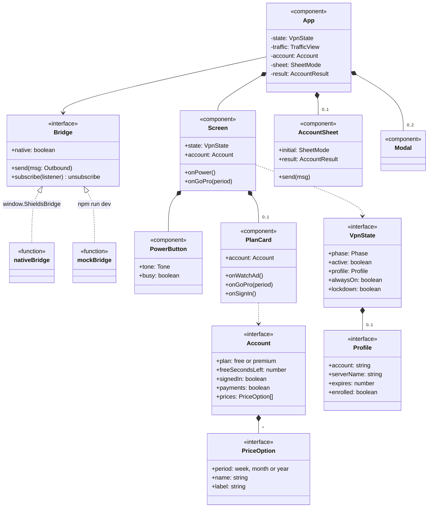
```mermaid
classDiagram
    class Bridge {
        <<interface>>
        +native: boolean
        +send(msg: Outbound)
        +subscribe(listener) unsubscribe
    }
    class nativeBridge {
        <<function>>
    }
    class mockBridge {
        <<function>>
    }
    class App {
        <<component>>
        -state: VpnState
        -traffic: TrafficView
        -account: Account
        -sheet: SheetMode
        -result: AccountResult
    }
    class Screen {
        <<component>>
        +state: VpnState
        +account: Account
        +onPower()
        +onGoPro(period)
    }
    class PowerButton {
        <<component>>
        +tone: Tone
        +busy: boolean
    }
    class PlanCard {
        <<component>>
        +account: Account
        +onWatchAd()
        +onGoPro(period)
        +onSignIn()
    }
    class AccountSheet {
        <<component>>
        +initial: SheetMode
        +result: AccountResult
        +send(msg)
    }
    class Modal {
        <<component>>
    }
    class VpnState {
        <<interface>>
        +phase: Phase
        +active: boolean
        +profile: Profile
        +alwaysOn: boolean
        +lockdown: boolean
    }
    class Account {
        <<interface>>
        +plan: free or premium
        +freeSecondsLeft: number
        +signedIn: boolean
        +payments: boolean
        +prices: PriceOption[]
    }
    class PriceOption {
        <<interface>>
        +period: week, month or year
        +name: string
        +label: string
    }
    class Profile {
        <<interface>>
        +account: string
        +serverName: string
        +expires: number
        +enrolled: boolean
    }
    Bridge <|.. nativeBridge : window.ShieldsBridge
    Bridge <|.. mockBridge : npm run dev
    App --> Bridge
    App *-- Screen
    App *-- "0..1" AccountSheet
    App *-- "0..2" Modal
    Screen *-- PowerButton
    Screen *-- "0..1" PlanCard
    Screen ..> VpnState
    PlanCard ..> Account
    Account *-- "*" PriceOption
    VpnState *-- "0..1" Profile
```

## 6. Object diagram

### PKI chain and a live peer

A snapshot of a running server: the SLH-DSA root, the server and client certificates it issued, an app device's
certificate, and the server's view of one connected peer. Values are examples in the default configuration.

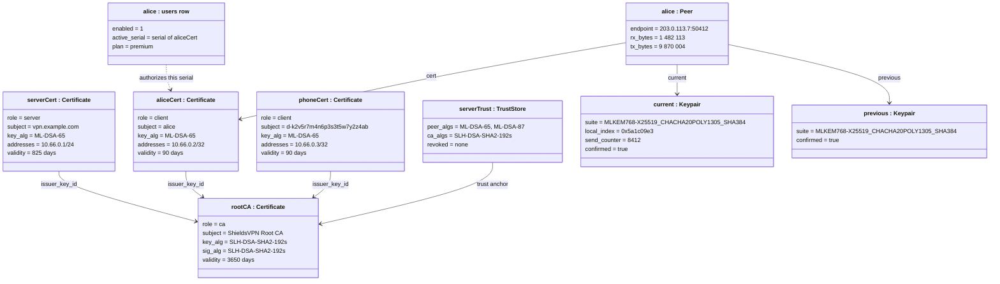
```mermaid
classDiagram
    class rootCA["rootCA : Certificate"] {
        role = ca
        subject = ShieldsVPN Root CA
        key_alg = SLH-DSA-SHA2-192s
        sig_alg = SLH-DSA-SHA2-192s
        validity = 3650 days
    }
    class serverCert["serverCert : Certificate"] {
        role = server
        subject = vpn.example.com
        key_alg = ML-DSA-65
        addresses = 10.66.0.1/24
        validity = 825 days
    }
    class aliceCert["aliceCert : Certificate"] {
        role = client
        subject = alice
        key_alg = ML-DSA-65
        addresses = 10.66.0.2/32
        validity = 90 days
    }
    class phoneCert["phoneCert : Certificate"] {
        role = client
        subject = d-k2v5r7m4n6p3s3t5w7y2z4ab
        key_alg = ML-DSA-65
        addresses = 10.66.0.3/32
        validity = 90 days
    }
    class trust["serverTrust : TrustStore"] {
        peer_algs = ML-DSA-65, ML-DSA-87
        ca_algs = SLH-DSA-SHA2-192s
        revoked = none
    }
    class alice["alice : Peer"] {
        endpoint = 203.0.113.7:50412
        rx_bytes = 1 482 113
        tx_bytes = 9 870 004
    }
    class kpCurrent["current : Keypair"] {
        suite = MLKEM768-X25519_CHACHA20POLY1305_SHA384
        local_index = 0x5a1c09e3
        send_counter = 8412
        confirmed = true
    }
    class kpPrevious["previous : Keypair"] {
        suite = MLKEM768-X25519_CHACHA20POLY1305_SHA384
        confirmed = true
    }
    class aliceRow["alice : users row"] {
        enabled = 1
        active_serial = serial of aliceCert
        plan = premium
    }
    serverCert --> rootCA : issuer_key_id
    aliceCert --> rootCA : issuer_key_id
    phoneCert --> rootCA : issuer_key_id
    trust --> rootCA : trust anchor
    alice --> aliceCert : cert
    alice --> kpCurrent : current
    alice --> kpPrevious : previous
    aliceRow ..> aliceCert : authorizes this serial
```

## 7. Sequence diagrams

### 7.1 VPN handshake and first data

The four-message handshake with the optional cookie and suite-retry round trips (PROTOCOL.md §5), then key
confirmation. `{...}` marks fields encrypted per fragment under handshake keys.

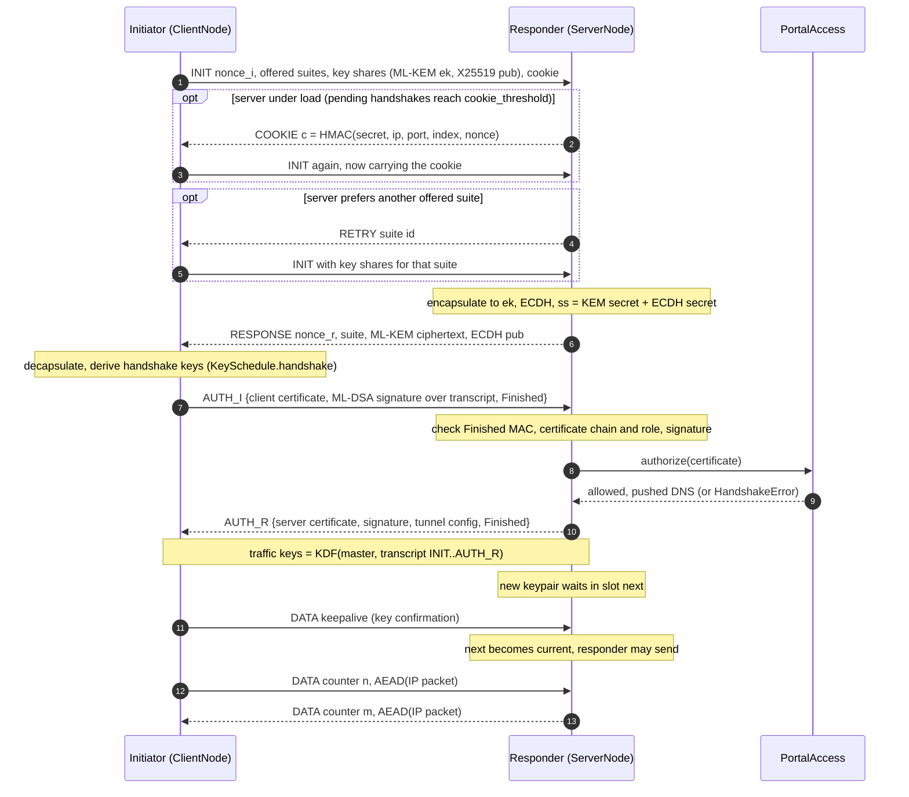
```mermaid
sequenceDiagram
    autonumber
    participant I as Initiator (ClientNode)
    participant R as Responder (ServerNode)
    participant PA as PortalAccess
    I->>R: INIT nonce_i, offered suites, key shares (ML-KEM ek, X25519 pub), cookie
    opt server under load (pending handshakes reach cookie_threshold)
        R-->>I: COOKIE c = HMAC(secret, ip, port, index, nonce)
        I->>R: INIT again, now carrying the cookie
    end
    opt server prefers another offered suite
        R-->>I: RETRY suite id
        I->>R: INIT with key shares for that suite
    end
    Note over R: encapsulate to ek, ECDH, ss = KEM secret + ECDH secret
    R-->>I: RESPONSE nonce_r, suite, ML-KEM ciphertext, ECDH pub
    Note over I: decapsulate, derive handshake keys (KeySchedule.handshake)
    I->>R: AUTH_I {client certificate, ML-DSA signature over transcript, Finished}
    Note over R: check Finished MAC, certificate chain and role, signature
    R->>PA: authorize(certificate)
    PA-->>R: allowed, pushed DNS (or HandshakeError)
    R-->>I: AUTH_R {server certificate, signature, tunnel config, Finished}
    Note over I,R: traffic keys = KDF(master, transcript INIT..AUTH_R)
    Note over R: new keypair waits in slot next
    I->>R: DATA keepalive (key confirmation)
    Note over R: next becomes current, responder may send
    I->>R: DATA counter n, AEAD(IP packet)
    R-->>I: DATA counter m, AEAD(IP packet)
```

### 7.2 Android connect

From the tap on the power button to a configured TUN interface. The handshake runs before any interface exists; the
interface is built once, from the authenticated server push.

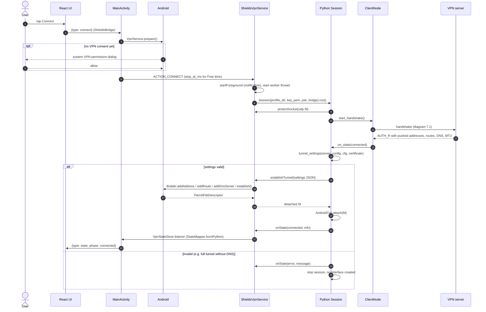
```mermaid
sequenceDiagram
    autonumber
    actor U as User
    participant UI as React UI
    participant MA as MainActivity
    participant OS as Android
    participant SVC as ShieldsVpnService
    participant PY as Python Session
    participant CN as ClientNode
    participant SRV as VPN server
    U->>UI: tap Connect
    UI->>MA: {type: connect} (ShieldsBridge)
    MA->>OS: VpnService.prepare()
    opt no VPN consent yet
        OS-->>U: system VPN permission dialog
        U-->>OS: allow
    end
    MA->>SVC: ACTION_CONNECT (stop_at_ms for Free time)
    SVC->>SVC: startForeground (notification), start worker thread
    SVC->>PY: Session(profile_dir, key_pem, psk, bridge).run()
    PY->>SVC: protectSocket(udp fd)
    PY->>CN: start_handshake()
    CN->>SRV: handshake (diagram 7.1)
    SRV-->>CN: AUTH_R with pushed addresses, routes, DNS, MTU
    CN->>PY: on_state(connected)
    PY->>PY: tunnel_settings(server_config, cfg, certificate)
    alt settings valid
        PY->>SVC: establishTunnel(settings JSON)
        SVC->>OS: Builder.addAddress / addRoute / addDnsServer / establish()
        OS-->>SVC: ParcelFileDescriptor
        SVC-->>PY: detached fd
        PY->>PY: AndroidTun.attach(fd)
        PY->>SVC: onState(connected, info)
        SVC->>MA: VpnStateStore listener (StateMapper.fromPython)
        MA->>UI: {type: state, phase: connected}
    else invalid (e.g. full tunnel without DNS)
        PY->>SVC: onState(error, message)
        PY->>PY: stop session, no interface created
    end
```

### 7.3 App device enrollment (Free, no account)

A portal build's first start: the phone makes its own ML-DSA key and registers; no account and no profile file.

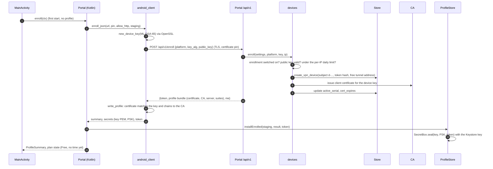
```mermaid
sequenceDiagram
    autonumber
    participant MA as MainActivity
    participant KP as Portal (Kotlin)
    participant PY as android_client
    participant API as Portal /api/v1
    participant DEV as devices
    participant ST as Store
    participant CA as CA
    participant PS as ProfileStore
    MA->>KP: enroll(ctx) (first start, no profile)
    KP->>PY: enroll_json(url, pin, allow_http, staging)
    PY->>PY: new_device_key(ML-DSA-65) via OpenSSL
    PY->>API: POST /api/v1/enroll {platform, key_alg, public_key} (TLS, certificate pin)
    API->>DEV: enroll(settings, platform, key, ip)
    DEV->>DEV: enrollment switched on? public key valid? under the per-IP daily limit?
    DEV->>ST: create_vpn_device(subject d-..., token hash, free tunnel address)
    DEV->>CA: issue client certificate for the device key
    DEV->>ST: update active_serial, cert_expires
    API-->>PY: {token, profile bundle (certificate, CA, server, suites), me}
    PY->>PY: write_profile: certificate matches the key and chains to the CA
    PY-->>KP: summary, secrets (key PEM, PSK), token
    KP->>PS: installEnrolled(staging, result, token)
    PS->>PS: SecretBox.seal(key, PSK, token) with the Keystore key
    KP-->>MA: ProfileSummary, plan state (Free, no time yet)
```

### 7.4 Free time from a rewarded ad

Google's signed server-side callback grants the time, not the app. The app only polls until the time appears.

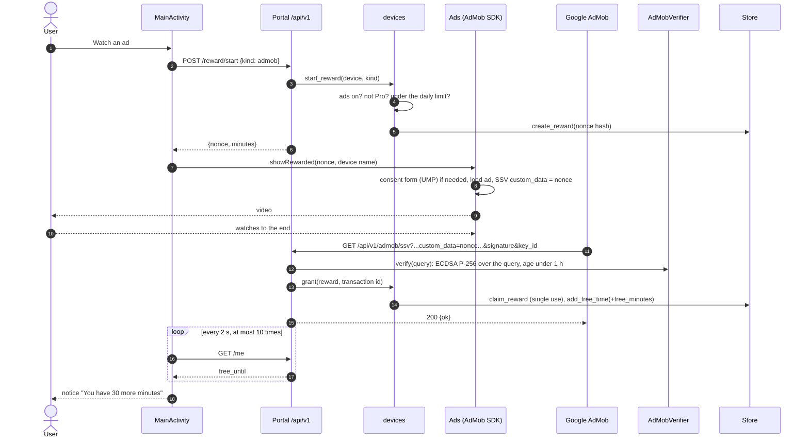
```mermaid
sequenceDiagram
    autonumber
    actor U as User
    participant MA as MainActivity
    participant API as Portal /api/v1
    participant DEV as devices
    participant ADS as Ads (AdMob SDK)
    participant G as Google AdMob
    participant V as AdMobVerifier
    participant ST as Store
    U->>MA: Watch an ad
    MA->>API: POST /reward/start {kind: admob}
    API->>DEV: start_reward(device, kind)
    DEV->>DEV: ads on? not Pro? under the daily limit?
    DEV->>ST: create_reward(nonce hash)
    API-->>MA: {nonce, minutes}
    MA->>ADS: showRewarded(nonce, device name)
    ADS->>ADS: consent form (UMP) if needed, load ad, SSV custom_data = nonce
    ADS-->>U: video
    U-->>ADS: watches to the end
    G->>API: GET /api/v1/admob/ssv?...custom_data=nonce...&signature&key_id
    API->>V: verify(query): ECDSA P-256 over the query, age under 1 h
    API->>DEV: grant(reward, transaction id)
    DEV->>ST: claim_reward (single use), add_free_time(+free_minutes)
    API-->>G: 200 {ok}
    loop every 2 s, at most 10 times
        MA->>API: GET /me
        API-->>MA: free_until
    end
    MA-->>U: notice "You have 30 more minutes"
```

### 7.5 Choosing a Pro plan and paying

The buyer picks weekly, monthly or yearly. The portal creates the Paddle transaction itself, and Pro switches on only
from data the portal fetched from Paddle's API.

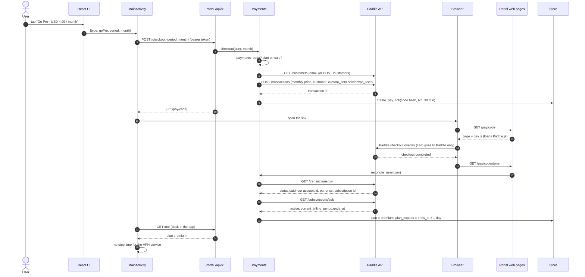
```mermaid
sequenceDiagram
    autonumber
    actor U as User
    participant UI as React UI
    participant MA as MainActivity
    participant API as Portal /api/v1
    participant PAY as Payments
    participant P as Paddle API
    participant B as Browser
    participant WEB as Portal web pages
    participant ST as Store
    U->>UI: tap "Go Pro · USD 4.99 / month"
    UI->>MA: {type: goPro, period: month}
    MA->>API: POST /checkout {period: month} (bearer token)
    API->>PAY: checkout(user, month)
    PAY->>PAY: payments ready? plan on sale?
    PAY->>P: GET /customers?email (or POST /customers)
    PAY->>P: POST /transactions {monthly price, customer, custom_data shieldsvpn_user}
    P-->>PAY: transaction id
    PAY->>ST: create_pay_link(code hash, txn, 30 min)
    API-->>MA: {url: /pay/code}
    MA->>B: open the link
    B->>WEB: GET /pay/code
    WEB-->>B: page + pay.js (loads Paddle.js)
    B->>P: Paddle checkout overlay (card goes to Paddle only)
    P-->>B: checkout.completed
    B->>WEB: GET /pay/code/done
    WEB->>PAY: reconcile_user(user)
    PAY->>P: GET /transactions/txn
    P-->>PAY: status paid, our account id, our price, subscription id
    PAY->>P: GET /subscriptions/sub
    P-->>PAY: active, current_billing_period.ends_at
    PAY->>ST: plan = premium, plan_expires = ends_at + 1 day
    MA->>API: GET /me (back in the app)
    API-->>MA: plan premium
    MA->>MA: no stop time for the VPN service
```

### 7.6 Admin sets the Pro prices

The admin types the amounts; the portal creates the Paddle prices before storing anything, and archives the prices
it replaced.

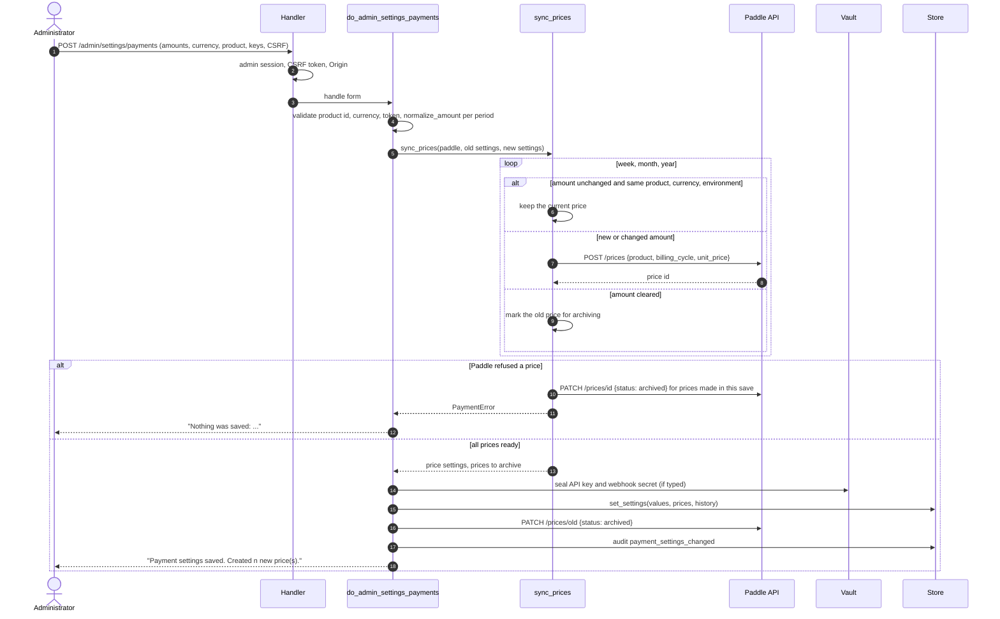
```mermaid
sequenceDiagram
    autonumber
    actor A as Administrator
    participant H as Handler
    participant F as do_admin_settings_payments
    participant SP as sync_prices
    participant P as Paddle API
    participant V as Vault
    participant ST as Store
    A->>H: POST /admin/settings/payments (amounts, currency, product, keys, CSRF)
    H->>H: admin session, CSRF token, Origin
    H->>F: handle form
    F->>F: validate product id, currency, token, normalize_amount per period
    F->>SP: sync_prices(paddle, old settings, new settings)
    loop week, month, year
        alt amount unchanged and same product, currency, environment
            SP->>SP: keep the current price
        else new or changed amount
            SP->>P: POST /prices {product, billing_cycle, unit_price}
            P-->>SP: price id
        else amount cleared
            SP->>SP: mark the old price for archiving
        end
    end
    alt Paddle refused a price
        SP->>P: PATCH /prices/id {status: archived} for prices made in this save
        SP-->>F: PaymentError
        F-->>A: "Nothing was saved: ..."
    else all prices ready
        SP-->>F: price settings, prices to archive
        F->>V: seal API key and webhook secret (if typed)
        F->>ST: set_settings(values, prices, history)
        F->>P: PATCH /prices/old {status: archived}
        F->>ST: audit payment_settings_changed
        F-->>A: "Payment settings saved. Created n new price(s)."
    end
```

### 7.7 Web sign-in with two-factor authentication

The password step and the TOTP step use separate sessions; a known browser has its own lockout bucket.

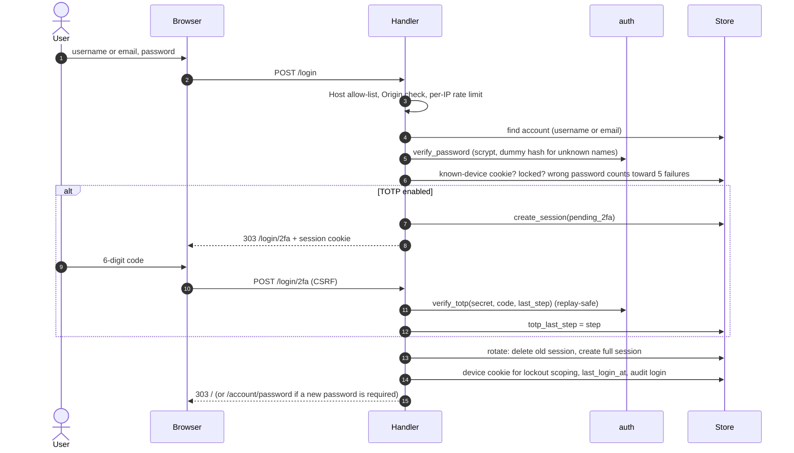
```mermaid
sequenceDiagram
    autonumber
    actor U as User
    participant B as Browser
    participant H as Handler
    participant AU as auth
    participant ST as Store
    U->>B: username or email, password
    B->>H: POST /login
    H->>H: Host allow-list, Origin check, per-IP rate limit
    H->>ST: find account (username or email)
    H->>AU: verify_password (scrypt, dummy hash for unknown names)
    H->>ST: known-device cookie? locked? wrong password counts toward 5 failures
    alt TOTP enabled
        H->>ST: create_session(pending_2fa)
        H-->>B: 303 /login/2fa + session cookie
        U->>B: 6-digit code
        B->>H: POST /login/2fa (CSRF)
        H->>AU: verify_totp(secret, code, last_step) (replay-safe)
        H->>ST: totp_last_step = step
    end
    H->>ST: rotate: delete old session, create full session
    H->>ST: device cookie for lockout scoping, last_login_at, audit login
    H-->>B: 303 / (or /account/password if a new password is required)
```

### 7.8 Password reset with an emailed code

Identical answers whether or not the account exists; the email is sent in the background.

```mermaid
sequenceDiagram
    autonumber
    actor U as User
    participant B as Browser
    participant H as Handler
    participant AC as accounts
    participant ST as Store
    participant M as Mail sender (Node.js)
    participant S as SMTP server
    U->>B: username or email
    B->>H: POST /forgot
    H->>AC: request_reset(login, ip)
    AC->>AC: account exists, enabled, has email, not throttled?
    opt allowed
        AC->>ST: create_reset(scrypt hash of a 6-digit code, 10 min)
        AC->>M: send_email_async(reset code message)
        M->>S: SMTP over TLS
        S-->>U: email with the code
    end
    H-->>B: 303 /forgot/verify (same answer in every case)
    U->>B: code + new password twice
    B->>H: POST /forgot/verify
    H->>AC: complete_reset(login, code, new password)
    AC->>ST: active_reset, verify code (5 attempts), consume_reset (single use)
    AC->>ST: new password hash, clear lockout, delete all sessions
    AC->>M: "password changed" notice
    H-->>B: 303 /login?reset=done
```

### 7.9 Profile download, connection and revocation

An administrator issues a profile ZIP; the VPN server checks the account at every handshake and every 2 s, so
disabling an account cuts its session within seconds.

```mermaid
sequenceDiagram
    autonumber
    actor A as Administrator
    actor U as User
    participant H as Portal web
    participant SV as service.issue_profile
    participant ST as Store (portal.db)
    participant C as Client (desktop or Android)
    participant SN as ServerNode
    participant PA as PortalAccess
    A->>H: POST /admin/users/id/profile
    H->>SV: issue_profile(user)
    SV->>ST: allocate tunnel address if none
    SV->>SV: new ML-DSA key, CA signs the client certificate
    SV->>ST: active_serial = new serial (older profiles stop working)
    H-->>A: pqvpn-user.zip (client.toml, certificate, key, CA, PSK)
    A-->>U: hand over the ZIP securely
    U->>C: import the ZIP / run pqvpn tray -c client.toml
    C->>SN: handshake
    SN->>PA: authorize(certificate)
    PA->>ST: user enabled and active_serial matches?
    PA-->>SN: allowed, plan DNS
    SN-->>C: AUTH_R, session up
    loop every 2 s (ServerNode.tick)
        SN->>PA: sync(peers)
        PA->>ST: publish_peers (live status)
    end
    A->>H: Disable user
    H->>ST: enabled = 0, delete portal sessions
    SN->>PA: sync(peers)
    PA->>ST: user still allowed?
    PA-->>SN: kick list [user]
    SN->>SN: disconnect(user): drop keypairs and routes
```

## 8. State machine diagrams

### 8.1 Handshake initiator

`handshake.Initiator.state` and how `ClientNode` reacts to failures and silence.

```mermaid
stateDiagram-v2
    [*] --> init : new Initiator, fresh ephemeral key shares, INIT sent
    init --> init : COOKIE received / resend INIT with the cookie
    init --> init : RETRY received / new key shares for that suite
    init --> auth : RESPONSE / derive handshake keys, send AUTH_I
    auth --> done : AUTH_R verified / traffic keys (Result)
    init --> failed : HandshakeError (bad RESPONSE, invalid key share)
    auth --> failed : HandshakeError (Finished MAC, certificate, signature, config)
    init --> abandoned : no answer for 30 s
    auth --> abandoned : no answer for 30 s
    done --> [*]
    failed --> [*] : client retries after a backoff of 1 s doubling to 30 s
    abandoned --> [*] : client starts over with fresh keys
    note right of init
        COOKIE and RETRY together are allowed at most 4 times.
        Lost datagrams are resent unchanged (1 s doubling to 8 s).
    end note
```

### 8.2 Keypair slots of a peer

WireGuard's three-slot model in `node.py`: the responder never sends on keys the initiator has not confirmed.

```mermaid
stateDiagram-v2
    [*] --> Next : responder installs (AUTH_I verified)
    [*] --> Current : initiator installs (AUTH_R verified)
    Next --> Current : first authenticated packet from the initiator (key confirmation)
    Next --> Dropped : replaced by a newer handshake
    Current --> Previous : a newer keypair becomes current
    Previous --> Dropped : a newer keypair becomes current again
    Current --> Dropped : age reaches 1.5 x rekey_interval, or counter exhausted
    Previous --> Dropped : age reaches 1.5 x rekey_interval
    Dropped --> [*]
    note right of Current
        Sends and receives. The client rekeys every
        rekey_interval (120 s) or after rekey_after_messages.
    end note
    note right of Previous
        Receive only: packets still in flight after a rekey.
    end note
```

### 8.3 Desktop client connection

The states `ClientNode` reports through `on_state` to the Windows window and tray.

```mermaid
stateDiagram-v2
    [*] --> disconnected
    disconnected --> connecting : start_handshake
    connecting --> connected : handshake complete
    connecting --> error : HandshakeError
    error --> reconnecting : retry after backoff
    reconnecting --> connected : handshake complete
    reconnecting --> error : HandshakeError
    connected --> reconnecting : no answer from the server for 15 s (dead-peer detection)
    connected --> connected : rekey every rekey_interval (no state change)
    connected --> disconnected : user disconnects, app exits, Free time over
    connecting --> disconnected : user disconnects
    reconnecting --> disconnected : user disconnects
    error --> disconnected : user disconnects (the error stays shown until the next action)
```

### 8.4 Android connection phase

`VpnUiState.phase` as set by `MainActivity`, `ShieldsVpnService` and `StateMapper`.

```mermaid
stateDiagram-v2
    [*] --> DISCONNECTED
    DISCONNECTED --> PREPARING : Connect (consent given), service starting
    PREPARING --> ERROR : consent declined, no profile, foreground start refused
    PREPARING --> CONNECTING : Python reports connecting
    CONNECTING --> CONNECTED : Python reports connected (interface established)
    CONNECTED --> RECONNECTING : dead peer or network change
    RECONNECTING --> CONNECTED : handshake complete
    CONNECTING --> ERROR : Python reports error (session keeps retrying)
    RECONNECTING --> ERROR : Python reports error (session keeps retrying)
    ERROR --> RECONNECTING : retry
    PREPARING --> DISCONNECTING : Disconnect
    CONNECTING --> DISCONNECTING : Disconnect, VPN revoked, Free time over
    CONNECTED --> DISCONNECTING : Disconnect, VPN revoked, Free time over
    RECONNECTING --> DISCONNECTING : Disconnect, VPN revoked, Free time over
    ERROR --> DISCONNECTING : Disconnect
    DISCONNECTING --> DISCONNECTED : session thread finished, stopped by the user
    DISCONNECTING --> ERROR : session finished with an error, or Free time ended
    ERROR --> PREPARING : Connect again
```

### 8.5 App device access (Free and Pro)

What `devices.decide` returns for an app-enrolled device. The VPN server applies it at every handshake and every 2 s.

```mermaid
stateDiagram-v2
    [*] --> Enabled : enroll (free_until = 0)
    state Enabled {
        [*] --> FreeNoTime
        FreeNoTime --> FreeWithTime : ad confirmed (+free_minutes)
        FreeWithTime --> FreeWithTime : another ad (time added to the end)
        FreeWithTime --> FreeNoTime : free_until passes, server drops the session
        FreeNoTime --> Pro : signed in to an account on Premium
        FreeWithTime --> Pro : signed in to an account on Premium
        state afterPro <<choice>>
        Pro --> afterPro : sign out, Premium ends, account deleted
        afterPro --> FreeWithTime : free_until still in the future
        afterPro --> FreeNoTime : no free time left
    }
    Enabled --> Disabled : admin disables the device or the linked account
    Disabled --> Enabled : admin enables it again
    Enabled --> [*] : admin deletes it, or anonymous and unseen for device_cleanup_days
    Disabled --> [*] : admin deletes it
    note right of Enabled
        VPN allowed only in FreeWithTime and Pro,
        and only with the latest certificate serial.
    end note
```

### 8.6 Account plan and Pro subscription

How an account's plan follows its Paddle subscription (`payments.py`) and the plan's end date (`plans.effective_plan`).

```mermaid
stateDiagram-v2
    [*] --> Free
    Free --> CheckoutOpen : POST /checkout for a chosen plan (pay link, 30 min)
    CheckoutOpen --> Free : link expires unpaid
    CheckoutOpen --> Premium : reconcile finds the transaction paid and the subscription active
    Premium --> Premium : renewal, plan_expires = new period end + 1 day
    Premium --> Cancelled : subscription canceled
    Cancelled --> Free : canceled_at + 1 day passes (never later than plan_expires)
    Premium --> Free : plan_expires passes without a renewal
    Free --> Premium : administrator sets Premium by hand (optional end date)
    Premium --> Free : administrator sets Free
    note right of Premium
        Paddle status active, trialing or past_due.
        Weekly, monthly and yearly plans differ only in
        the billing period Paddle reports.
    end note
```

### 8.7 Portal web session

A browser session from sign-in to expiry (`web.Handler._authorize`, `Store.session`).

```mermaid
stateDiagram-v2
    [*] --> Anonymous
    Anonymous --> Pending2FA : password correct, TOTP enabled
    Anonymous --> SignedIn : password correct, no TOTP
    Pending2FA --> SignedIn : valid TOTP code (session rotated)
    Pending2FA --> Anonymous : 5 wrong codes (lockout) or cancel
    state SignedIn {
        [*] --> gate
        state gate <<choice>>
        gate --> MustChangePassword : must_change_password
        gate --> MustSetUp2FA : admin without 2FA (require_2fa_for_admins)
        gate --> Full : otherwise
        MustChangePassword --> Full : new password saved
        MustSetUp2FA --> Full : 2FA turned on
    }
    SignedIn --> Anonymous : sign out
    SignedIn --> Anonymous : idle 30 min or 12 h since sign-in
    SignedIn --> Anonymous : password changed or reset elsewhere, admin disables or signs out the user
    SignedIn --> Anonymous : portal set to administrators only (users)
```

## 9. Activity diagrams

### 9.1 Server handling of one UDP datagram

`ServerNode.datagram_received` and what follows for data and handshake packets. Anything malformed is dropped
silently; one bad packet never stops the node.

```mermaid
flowchart TD
    S((start)) --> A["Normalize source address (IPv4-mapped IPv6)"]
    A --> T{"First byte?"}
    T -->|"0x04 data"| D1{"Receiver index known and keypair younger than 1.5 x rekey_interval?"}
    D1 -->|no| X1["Drop"]
    D1 -->|yes| D2{"Counter inside the replay window and AEAD tag valid?"}
    D2 -->|no| X1
    D2 -->|yes| D3["Mark received, last_rx = now"]
    D3 --> D4{"Keypair in slot next?"}
    D4 -->|yes| D5["Confirm: next becomes current"]
    D4 -->|no| D6
    D5 --> D6{"Newest packet from a new address?"}
    D6 -->|yes| D7["Roam: peer.endpoint = new address"]
    D6 -->|no| D8
    D7 --> D8{"Empty payload?"}
    D8 -->|"yes (keepalive)"| D9["Schedule a keepalive answer"]
    D8 -->|no| D10{"Valid IP packet and source address owned by this peer?"}
    D10 -->|no| X1
    D10 -->|yes| D11["Write to TUN"]
    T -->|"0x01 handshake"| H1{"Header and fragment lengths consistent?"}
    H1 -->|no| X1
    H1 -->|yes| H2{"Message type?"}
    H2 -->|INIT| I1["Reassemble fragments"]
    I1 --> I2{"Same INIT as an open handshake?"}
    I2 -->|yes| I3["Resend the cached RESPONSE"]
    I2 -->|no| I4{"Under load (always_require_cookie or pending ≥ cookie_threshold)?"}
    I4 -->|yes| I5{"Per-IP rate limit allows?"}
    I5 -->|no| X1
    I5 -->|yes| I6{"Valid cookie in INIT?"}
    I6 -->|no| I7["Send COOKIE"]
    I4 -->|no| I8
    I6 -->|yes| I8{"Mutual suite equals the share suite?"}
    I8 -->|no| I9["Send RETRY with the server's preferred suite"]
    I8 -->|yes| I10["Encapsulate and ECDH, store half-open state, send RESPONSE"]
    H2 -->|AUTH_I| A1{"Half-open state for this index and address?"}
    A1 -->|no| X1
    A1 -->|yes| A2["Decrypt fragment (trial with and without PSK if psk_optional), reassemble"]
    A2 --> A3{"Finished MAC, certificate, signature valid and PortalAccess allows?"}
    A3 -->|no| A4["Log, forget the half-open state"]
    A3 -->|yes| A5["Send AUTH_R, install keypair in slot next, update routes"]
    X1 --> E(((stop)))
    D9 --> E
    D11 --> E
    I3 --> E
    I7 --> E
    I9 --> E
    I10 --> E
    A4 --> E
    A5 --> E
```

### 9.2 Android tunnel-settings validation

`android_client.tunnel_settings`: the server's authenticated push is checked against the client certificate, and a
setup that would leak fails closed.

```mermaid
flowchart TD
    S((start)) --> A{"Pushed config is an object with at least one address?"}
    A -->|no| F["Raise TunnelConfigError: refuse to connect"]
    A -->|yes| B{"Every address is a host address from this device's certificate, prefix not /0?"}
    B -->|no| F
    B -->|yes| C["Routes: from the profile if it sets any, else from the server"]
    C --> D{"Full tunnel in the profile?"}
    D -->|yes| D1["Add default routes for each family that has a tunnel address"]
    D -->|no| G
    D1 --> G["Drop routes of families without a tunnel address"]
    G --> H{"1 to 256 routes left?"}
    H -->|no| F
    H -->|yes| I["DNS: profile, else server push if use_server_dns, drop wrong-family servers, keep 8"]
    I --> J{"Full tunnel and no DNS server?"}
    J -->|yes| F
    J -->|no| K["MTU = min(profile MTU, server MTU 1280..9000)"]
    K --> L{"Full tunnel?"}
    L -->|yes| L1["Block families without a tunnel address (no IPv6 leak)"]
    L -->|no| L2["Let families without a tunnel address bypass the VPN"]
    L1 --> M["Return settings for VpnService.Builder"]
    L2 --> M
    F --> E(((stop)))
    M --> E
```

### 9.3 Web sign-in with lockout

`web.do_login`: no user enumeration, and lockout scoped so an attacker cannot lock the owner out of the browser they
usually use.

```mermaid
flowchart TD
    S((start)) --> A{"Per-IP rate limit allows?"}
    A -->|no| R429["429: wait a minute"]
    A -->|yes| B["Find account by username or email, verify password (scrypt, dummy hash if unknown)"]
    B --> C{"Account exists?"}
    C -->|no| G["401: generic message, audit with a redacted actor"]
    C -->|yes| D{"Known device cookie for this account?"}
    D --> L{"Locked? (device bucket if known, else account bucket)"}
    L -->|yes| G
    L -->|no| P{"Password correct?"}
    P -->|no| P1["Count a failure in that bucket, 5 failures lock it for 15 min"]
    P1 --> G
    P -->|yes| EN{"Enabled, email verified, allowed to sign in (admins-only setting)?"}
    EN -->|no| G2["401 or 403 with the reason"]
    EN -->|yes| RS["Reset the failure counter"]
    RS --> T{"TOTP enabled?"}
    T -->|yes| T1["Pending-2FA session, go to /login/2fa"]
    T -->|no| OK["Rotate session, set device cookie, audit login"]
    OK --> MC{"Must change password?"}
    MC -->|yes| MC1["Go to /account/password"]
    MC -->|no| HOME["Go to the requested page or /"]
    R429 --> E(((stop)))
    G --> E
    G2 --> E
    T1 --> E
    MC1 --> E
    HOME --> E
```

### 9.4 Saving the payment settings

`web.do_admin_settings_payments` with `payments.sync_prices`, split into what the portal does and what Paddle does.

```mermaid
flowchart TD
    subgraph portal["Portal"]
        S((start)) --> V{"Environment, product id, currency, client token, amounts valid?"}
        V -->|no| VE["Show the error, nothing saved"]
        V -->|yes| N["Merge with the saved settings (typed secrets replace saved ones)"]
        N --> LP["For each period: week, month, year"]
        LP --> Q{"Amount set?"}
        Q -->|no| Q1["Price cleared, old price queued for archiving"]
        Q -->|yes| Q2{"Same amount, product, currency and environment as the current price?"}
        Q2 -->|yes| Q3["Keep the current price"]
        Q2 -->|no| Q4{"API key and product id present?"}
        Q4 -->|no| FAIL["Archive prices made in this save, show 'Nothing was saved'"]
        Q1 --> NX{"More periods?"}
        Q3 --> NX
        NX -->|yes| LP
        NX -->|no| SAVE["Seal secrets with the vault, store settings and price history"]
        SAVE --> ARC["Archive the replaced prices (not on an environment change)"]
        ARC --> AU["Audit, show 'Payment settings saved'"]
    end
    subgraph paddle["Paddle"]
        PC["POST /prices (billing cycle, unit price in the smallest unit)"]
        PR{"Accepted?"}
        PA["PATCH /prices/id status archived"]
    end
    Q4 -->|yes| PC
    PC --> PR
    PR -->|yes, new price id| NX
    PR -->|no| FAIL
    ARC --> PA
    VE --> E(((stop)))
    FAIL --> E
    AU --> E
```
